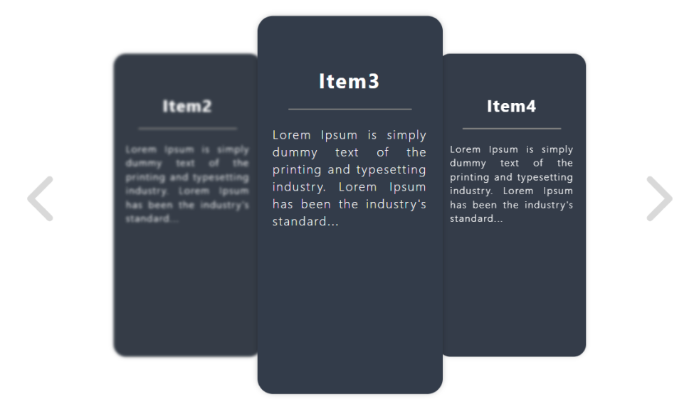
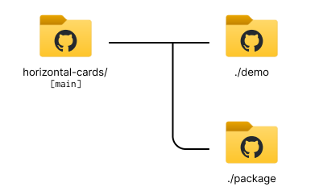

# Hozirontal Cards package

<b>NB : </b><u>To learn how to use this package, I invite you to review the instructions located in the "./package/" folder!</u>

## Overview

The inspiration behind this React package stems from the observed absence of a convenient horizontal scroller list component in the React ecosystem. This package addresses this gap by providing a seamless solution to display items from a list in the form of infinitely scrolled cards. If you're looking to enhance user experience by incorporating a horizontal scrolling feature for your lists, this package is tailored to meet your needs.

## Features

* **Horizontal Scrolling:** Easily implement a horizontal scrolling list of items, offering a modern and intuitive user interface.
* **Infinite Scroll:** The package enables the infinite scrolling of cards, providing a smooth and continuous browsing experience for users.
* **Customizable:** Tailor the appearance and behavior of the scroller to align with your application's design and requirements.
* **Efficient Rendering:** Benefit from optimized rendering to ensure a responsive and performant user interface, even when dealing with large datasets.

## Live demo

Experience the live demo of the package by visiting the demo website [here](https://haitamdevops.github.io/horizontal-cards/), where you can interact with the application's features in real-time.

## Repository structure

Within this repository, you'll find a well-organized structure comprising two primary folders: [**./demo/**](./demo/) and **./package/**.

* The **./package/** folder contains the source code for the **Horizontal Cards** NPM package, providing a comprehensive view of the underlying implementation.
* The **./demo/** folder hosts a React application dedicated for developers seeking a hands-on experience. You can effortlessly clone this folder onto your local environment to explore and test the functionalities offered by the **Horizontal Cards** package in a real-world setting.

## License

Horizontal Cards package is released under the [MIT license](https://www.mit.edu/~amini/LICENSE.md).
