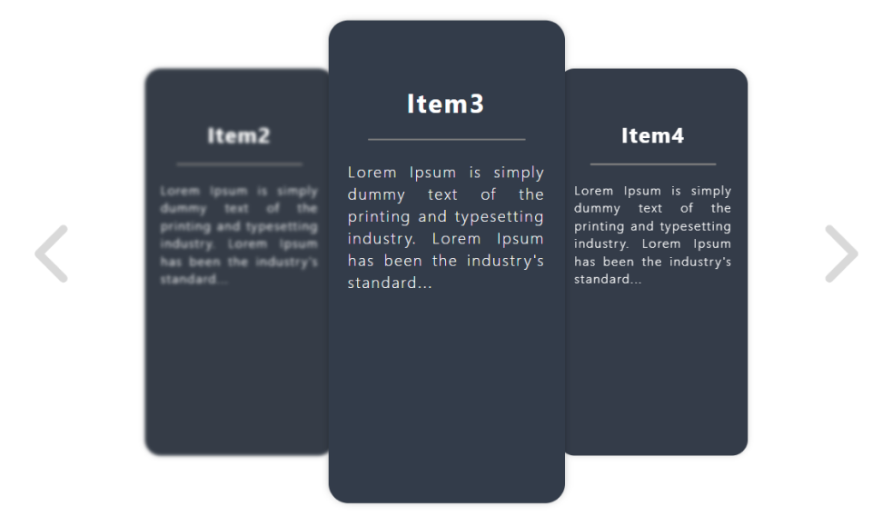

# Hozirontal Cards package



## Overview

The inspiration behind this React package stems from the observed absence of a convenient horizontal scroller list component in the React ecosystem. This package addresses this gap by providing a seamless solution to display items from a list in the form of infinitely scrolled cards. If you're looking to enhance user experience by incorporating a horizontal scrolling feature for your lists, this package is tailored to meet your needs.

## Features

* **Horizontal Scrolling:** Easily implement a horizontal scrolling list of items, offering a modern and intuitive user interface.
* **Infinite Scroll:** The package enables the infinite scrolling of cards, providing a smooth and continuous browsing experience for users.
* **Customizable:** Tailor the appearance and behavior of the scroller to align with your application's design and requirements.
* **Efficient Rendering:** Benefit from optimized rendering to ensure a responsive and performant user interface, even when dealing with large datasets.

## Installation

To integrate the Horizontal Cards into your project, follow these simple steps:

```shell
npm install horizontal-cards
```

or

```shell
yarn add horizontal-cards
```

## Usage

*- To be inserted later -*

## Example

*- To be inserted later -*
